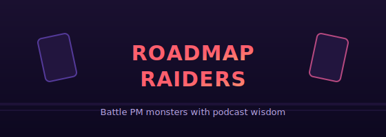

<p align="center">
  
</p>

# Roadmap Raiders

**A card-battle game where you fight the monsters every product manager knows — Scope Creep, the HiPPO, the Feature Factory — using a deck of heroes built from real [Lenny's Podcast](https://www.lennyspodcast.com/) guests.** Plays in your browser. Nothing to install.

<p align="center">
  <strong><a href="https://axel-pm.github.io/munchkin/">▶ Play it now</a></strong>
</p>

---

## The idea

Every PM fights the same beasts: scope that won't stop growing, the Highest-Paid Person's Opinion, a backlog that ships features nobody asked for. Roadmap Raiders turns them into a light, Munchkin-style card game — and turns the people who actually have answers into your party.

The **hero cards are real Lenny's Podcast guests**, and their stats aren't made up: they're derived from each guest's episode data (views, runtime, how much they had to say). So Eric Ries hits differently than a first-time founder, and your job is to draw the right minds to beat the monster in front of you.

## How to play

1. **Open the game** — [play in your browser](https://axel-pm.github.io/munchkin/), or run it locally (below).
2. **Draft 3 heroes** from the podcast-guest deck to start your party.
3. **Face a PM monster.** Play hero cards so your total **Attack** beats the monster's power.
4. **Win the fight** to claim **treasures** — PM tools and frameworks like the OKR Framework, North Star Metric, and Product-Market Fit — and level up.
5. **Reach Level 10** to win the run.

Each hero also has a **special ability** drawn from what they talk about on the podcast, so the deck plays differently every time.

## What's in the deck

Built from **289 podcast episodes**:

- **60 hero cards** — real guests, stats derived from episode data
- **15 monster cards** — PM anti-patterns: Scope Creep Dragon, Bikeshedding Demon, The HiPPO, Technical Debt Golem, Stakeholder Hydra, Churn Wraith, and more
- **12 treasure cards** — the frameworks and wins that turn a fight around

## Run it locally

No build step — it's plain HTML, CSS, and JavaScript.

```bash
python3 -m http.server 8080
# then open http://localhost:8080
```

## Regenerating the deck

The card data is generated from an open dataset of podcast transcripts. To rebuild it:

```bash
# Grab the source data
git clone https://github.com/LennysNewsletter/lennys-newsletterpodcastdata-all.git

# Extract cards → data/cards.json
pip install pyyaml
python3 scripts/extract_cards.py
```

## Credits

Card data is derived from [Lenny's Podcast](https://www.lennyspodcast.com/) via the community [podcast dataset](https://github.com/LennysNewsletter/lennys-newsletterpodcastdata-all). Hero cards celebrate the guests and their ideas; this is an unofficial fan project and isn't affiliated with or endorsed by the podcast.

## License

[MIT](LICENSE).
