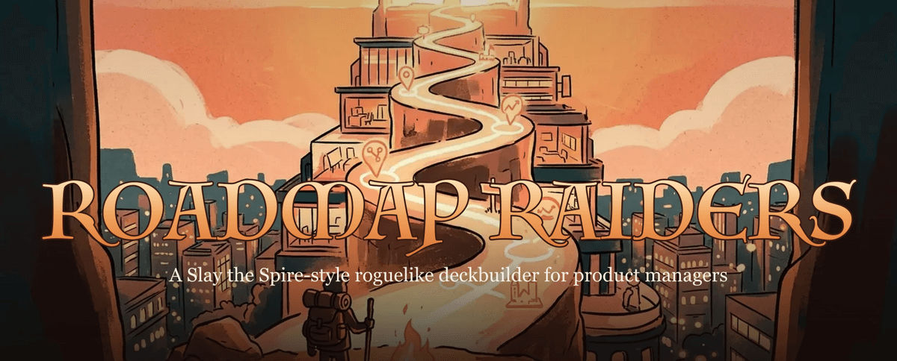
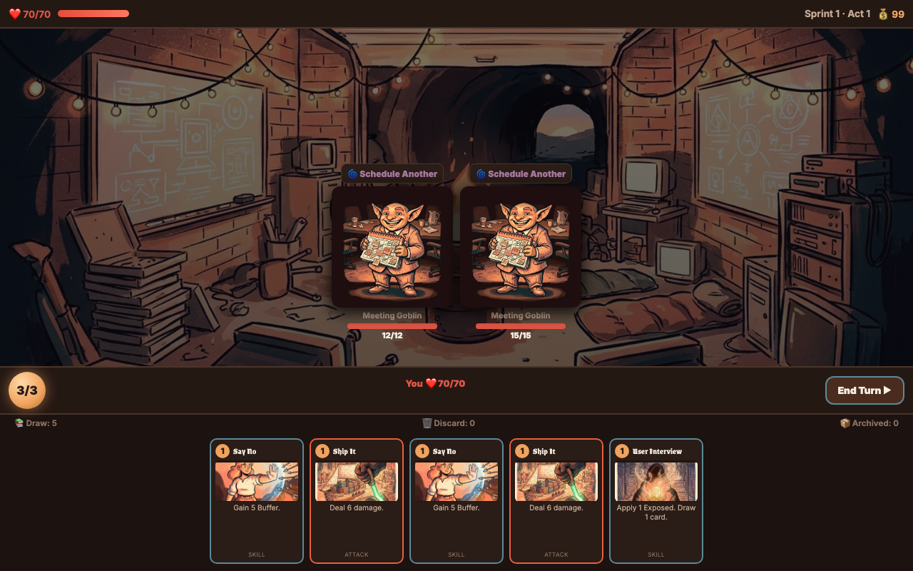
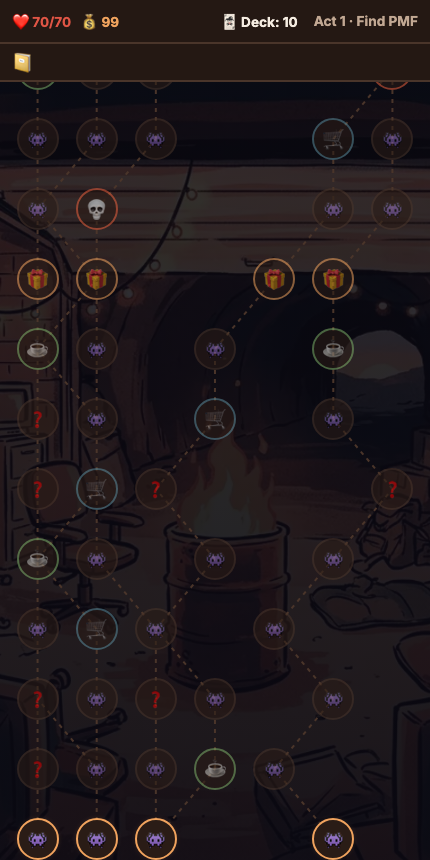
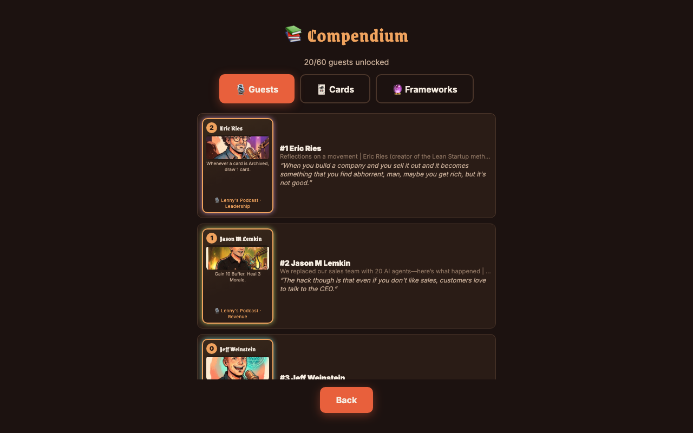

<p align="center">
  
</p>

# Roadmap Raiders

**A roguelike deckbuilder in the style of Slay the Spire, where you climb the product roadmap, fight the monsters every product manager knows — Scope Creep, the HiPPO, the Feature Factory — and recruit real [Lenny's Podcast](https://www.lennyspodcast.com/) guests into your deck.** Plays in your browser. Nothing to install.

<p align="center">
  <strong><a href="https://axel-pm.github.io/roadmap-raiders/">▶ Play it now</a></strong>
</p>

<p align="center">
  
</p>

## The game

You're a PM climbing **The Roadmap**, a branching map through three acts: **Find PMF**, **Scale-Up**, and **The IPO Road**. You fight PM anti-patterns in turn-based card combat, build a deck as you go, collect framework relics, drink questionable amounts of coffee, and finally face **The HiPPO** (the Highest Paid Person's Opinion) at the top.

- **⚔️ Turn-based card combat.** 3 Bandwidth per turn, a hand of 5, Buffer to block, and enemies that telegraph their next move. Attacks, Skills, and Powers, plus PM-flavored statuses: Momentum, Exposed, Tech Debt, Burnout, Heads-Down.
- **🎙️ 60 real podcast guests as unique cards.** Each guest's card is derived from their actual episode data (domain, stats, signature ability), with their real quotes as flavor text. The most-watched guests get handcrafted mechanics: Eric Ries runs a Lean Loop, Marc Andreessen goes PMF-or-Die.
- **🗺 A branching roadmap.** Fights, elites, ?-events, shops, retros (heal or upgrade a card), treasures, and a boss at the end of every act.
- **🔮 28 framework relics.** OKRs, North Star Metric, AI Copilot, Product-Market Fit — passive items that change how your deck plays.
- **📈 Progression that sticks.** Runs earn Listener XP that unlocks more guests. Wins unlock Ascension levels 1–10. Mid-run saves survive a refresh, and seeded runs are reproducible.
- **🎨 A hand-painted world.** Every card, guest, and enemy is its own illustration in a warm "campfire-lit corporate fantasy" style, with a moody backdrop for each act.
- **🎵 A moody soundtrack.** A continuous ambient background loop across the whole game, plus a full sound-effects bank synthesized from scratch in code.
- **📱 Installable and offline.** Add it to your home screen and it launches fullscreen like an app; after the first visit it plays with no connection. Juicy on touch: cards fly to their target, hits shake the screen, long-press any card to inspect it.

<p align="center">
  
  &nbsp;&nbsp;
  
</p>

## Monsters you already know

Meeting Goblins (they multiply), the Bikeshedding Demon, the MVP Mimic, the Scope Creep Dragon (it stuffs curses into your deck), the Stakeholder Hydra (three heads, and killing one enrages the rest), the Burnout Phoenix (it *will* rise again), the Deadline Reaper (ship or die), and The HiPPO — 300 HP of pure gut feel.

## Run it locally

```bash
npm install
npm run dev        # dev server
npm test           # engine + simulation tests
npm run build      # production build to dist/
```

Built with Vite and TypeScript, no framework. The combat engine is headless and unit-tested; a greedy bot plays complete seeded runs in CI as a balance sanity check.

## How it's put together

```
src/
  core/       seeded RNG (named streams, serializable), typed events
  engine/     combat engine, map generator, run state, saves — no DOM
  content/    cards, enemies, relics, coffees, events, guest generator
  ui/         DOM screens and components
data/         guests.json (generated from 289 podcast episodes)
tests/        engine unit tests + full-run simulation
```

Guest cards are generated from `data/guests.json` at load time. Regenerate it with `npm run transform`; rebuild the underlying card data with `scripts/extract_cards.py` against the community [podcast dataset](https://github.com/LennysNewsletter/lennys-newsletterpodcastdata-all).

## Credits

Card data comes from [Lenny's Podcast](https://www.lennyspodcast.com/) via the community dataset. Guest cards celebrate the guests and their ideas; this is an unofficial fan project and isn't affiliated with or endorsed by the podcast. Game design inspired by Slay the Spire.

All in-game artwork is AI-generated (Google's Nano Banana image model) via the prompts in `scripts/art/`. Guest card characters are fictional illustrations painted from written appearance descriptions — stylized artistic interpretations, not photographs or edited photos.

The sound effects are synthesized from scratch in code (`scripts/audio/`, rendered to `.m4a` — regenerate with `node scripts/audio/build-audio.mjs`, needs macOS `afconvert`). Background music: "The Hollow Loop."

## License

[MIT](LICENSE).
